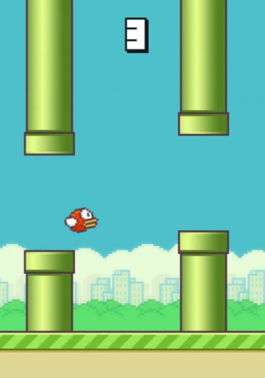
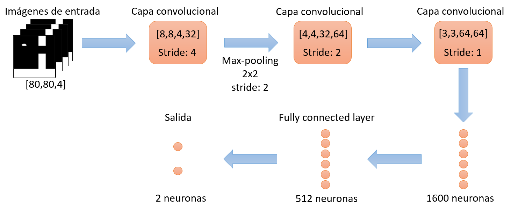

# Flappy Bird DQL Agent

Welcome to the Flappy Bird DQL (Deep Q-Learning) Agent repository! This project is an exploration into the capabilities of reinforcement learning, specifically utilizing a DQL algorithm to train an agent to play the game of Flappy Bird autonomously. The goal is not just to play but to surpass human-level performance, aiming to beat my personal best score in the game (255).

*Click on the image to watch a video of the DQL agent in action.*

## Features

- **Deep Q-Learning (DQL) Algorithm**: At the core of this project is the DQL algorithm, which enables the agent to learn optimal actions based on state inputs by using a deep neural network.
- **Custom Flappy Bird Environment**: A tailored version of the Flappy Bird game that interfaces with our DQL agent, providing the necessary state and reward signals for training.
- **Python and Pygame**: The game is built and runs on Python, with Pygame handling the game's graphics and interactions.
- **TensorFlow**: These libraries are used for building and training the deep learning models that the DQL agent relies on.
- **Matplotlib**: For plotting training progress and results.

## Requirements

To run this project, you'll need the following Python version and libraries:

1. Python 3.6 or greater
2. pygame==2.0.1 or greater
3. opencv-python==4.5.1
4. tensorflow==1.15.0
5. matplotlib==3.3.4
6. numpy==1.19.5

## Results

The results section will detail the performance of the DQL agent throughout its training process. The agent's score progression over time will be plotted to illustrate improvements and learning stability.

## Training

### Results

During training, the agent interacted with the Flappy Bird environment, with each game episode providing a sequence of states, actions, and rewards. The plot below shows the score per episode over the training period.

### Personal Record Beating Attempt

After sufficient training, the DQL agent was set to the task of beating my personal best score. The attempt was recorded and is available for viewing:

### Training the DQL Agent

Navigate to the `src` directory and execute the following command to start training the agent:
