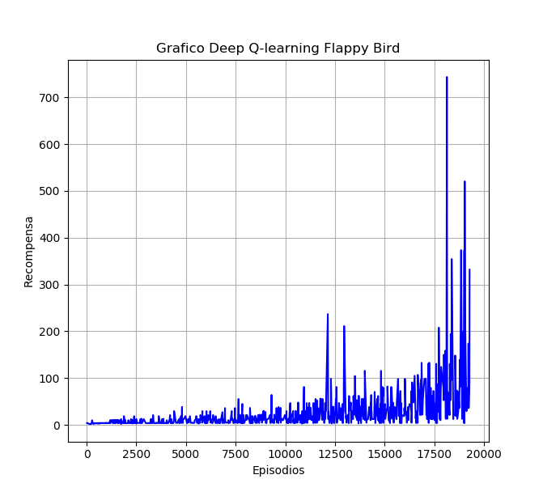

# Flappy Bird DQL Agent

Welcome to the Flappy Bird DQL (Deep Q-Learning) Agent repository! This project is an exploration into the capabilities of reinforcement learning, specifically utilizing a DQL algorithm to train an agent to play the game of Flappy Bird autonomously. The goal is not just to play but to surpass human-level performance, aiming to beat my personal best score in the game (255).

## Features

- **Deep Q-Learning (DQL) Algorithm**: At the core of this project is the DQL algorithm, which enables the agent to learn optimal actions based on state inputs by using a deep neural network.
- **Custom Flappy Bird Environment**: A tailored version of the Flappy Bird game that interfaces with our DQL agent, providing the necessary state and reward signals for training.
- **Python and Pygame**: The game is built and runs on Python, with Pygame handling the game's graphics and interactions.
- **TensorFlow**: These libraries are used for building and training the deep learning models that the DQL agent relies on.
- **Matplotlib**: For plotting training progress and results.

## Requirements

To run this project, you'll need the following Python version and libraries:

1. Python 3.6 or greater
2. pygame==2.0.1 or greater
3. opencv-python==4.5.1
4. tensorflow==1.15.0
5. matplotlib==3.3.4
6. numpy==1.19.5

## Training
The DQL model processes a sequence of four grayscale frames from the game as input, providing a temporal snapshot to inform decision-making. These frames pass through three convolutional layers, each designed to extract and condense spatial features from raw pixels to complex patterns, with dimensionality reduction occurring at each step.

The convolutional layers are followed by three fully connected layers that integrate these features into a high-level representation. The output layer, consisting of two neurons with a softmax activation, yields the probabilities of the two possible actions: "jump" or "do not jump". This architecture enables the DQL model to interpret visual data and learn action strategies through reinforcement learning, aiming to maximize game scores. The model's architecture can be visualized in the following image:

### Results

During training, the agent interacted with the Flappy Bird environment, with each game episode providing a sequence of states, actions, and rewards. The plot below shows the score per episode over the training period.

### Personal Record Beating Attempt

After sufficient training, it was time to take on the formidable challenge of surpassing my personal best score. A milestone I had achieved with countless hours of dedication and a dash of sweat and tears. It was a bittersweet feeling to set my digital protege against a record that represented me. The attempt was recorded and is available for viewing:

*Click on the image to watch a video of the DQL agent in action.*